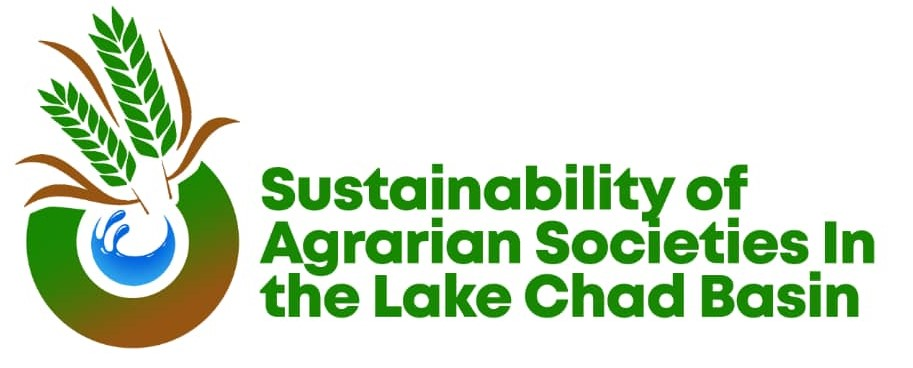

https://www.sustainabilitylakechad.com/

<h1>Bayesian statistics in Sustainability Science with a focus on Agrarian Societies and Ecosystem Services in the Lake Chad Basin</h1>
This respository is for shared materials for the 2026 Bayesian statistics workshop in Abuja, Nigeria. Workshop participants should fork this repository to their github user accounts.

## Workshop Description

The workshop will consist of **five in-person days from January 12 to 16, 2026**, and approx. **10 hours of online preparatory material** prior to the in-person workshop in Abuja. All activities use free, open-access tools. 

## Broad learning objectives

I. Participants will gain **confidence** and a set of **tools** for continued **self-directed learning** in computational skills and data analysis.
II. Participants will develop an **intuitive understanding** of Bayesian data analysis and its **applicability to real-world scenarios**.
III. Participants will **implement a Bayesian data analysis** workflow with a real dataset from the SLC project.

## Pre-workshop materials
<h3> All pre-workshop materials can be accessed from our interactive course page. </h3>

https://lakechadproject.github.io/bayes2026-preworkshop-map/ 

The purpose of the pre-workshop materials is to maximize the value of the in-person workshop days. **These materials are freely available to anyone**. By the end of the pre-workshop materials, participants will: 

1. Install the necessary software and packages on their computer.
2. Familiarize themselves with basics of R coding through practice exercises.
3. Practice a coding and analysis workflow that will serve them during the workshop and beyond.
4. Familiarize themselves with fundamental concepts and applications of Bayesian data analysis.

The pre-workshop materials will consist of self-guided activities including readings, videos, and exercises. Students will have two opportunities to meet virtually with instructors in January 2025. The first virtual session will be focused on troubleshooting issues with software installation, R coding, and other computational topics. The second virtual session will be focused on reviewing concepts of Bayesian data analysis. 
 
Before the in-person session, we will ask participants to complete a survey to assess their learning and evaluate their interests to help sort them into project groups.

## In-person Workshop
The in-person workshop will give students an opportunity to continue building their computational and analytical skills. All activities of the workshop will be organized around a group project in which they will implement a Bayesian data analysis workflow on a real dataset. 

