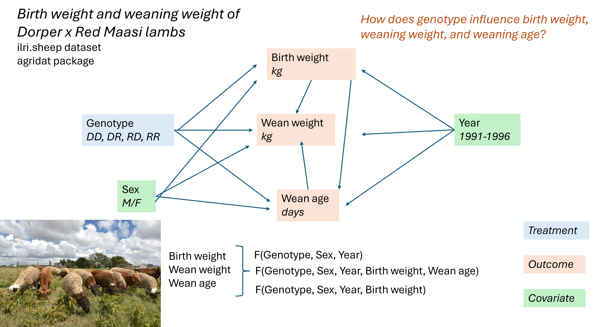

```{r setup, include=FALSE}
knitr::opts_chunk$set(echo = TRUE)
```

For this exercise, you will go through the process of developing a causal diagram, as demonstrated in the lecture. Your end product will be something like this, but for a different dataset. You can draw your diagram on a piece of paper or on the computer, depending on your preference.  




### 1. Choose a dataset from the agridat package (not ilri.sheep).

To see a list of datasets, you can look at the help documentation for agridat, or visit https://kwstat.r-universe.dev/agridat.

First, install the package if you haven't already.
```{r, eval = FALSE}
install.packages("agridat") # run this line

```

To check the documentation, load the package and use ? as below:
```{r, eval=FALSE}
library(agridat)
?agridat

```


### 2. Read the documentation for your dataset. Identify one or more research questions and variables of interest. 

You can find the details about your dataset by running a line of code with ? followed by the dataset name.

```{r, eval = FALSE}
?ilri.sheep

```


### 3. Draw a causal diagram (DAG) for your system. 

Use your scientific reasoning to think though cause-and-effect relationships between variables. Denote variables as nodes and causal relationships as arrows. Distinguish treatments and covariates based on your research question. Include the units or data type for each variable.

### 4. Write outcomes of interest as general functions of other variables. 

For example, birth weight = f(genotype, sex, year)

### 5. Re-evaluate your diagram.

Take another look at your diagram. Are there any variables, observed or unobserved, that you might want to add or remove? Causal relationships you might want to add or remove? 


